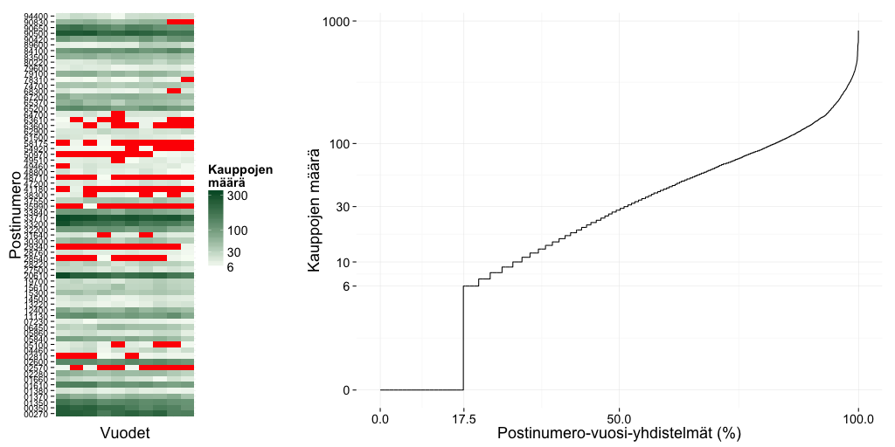
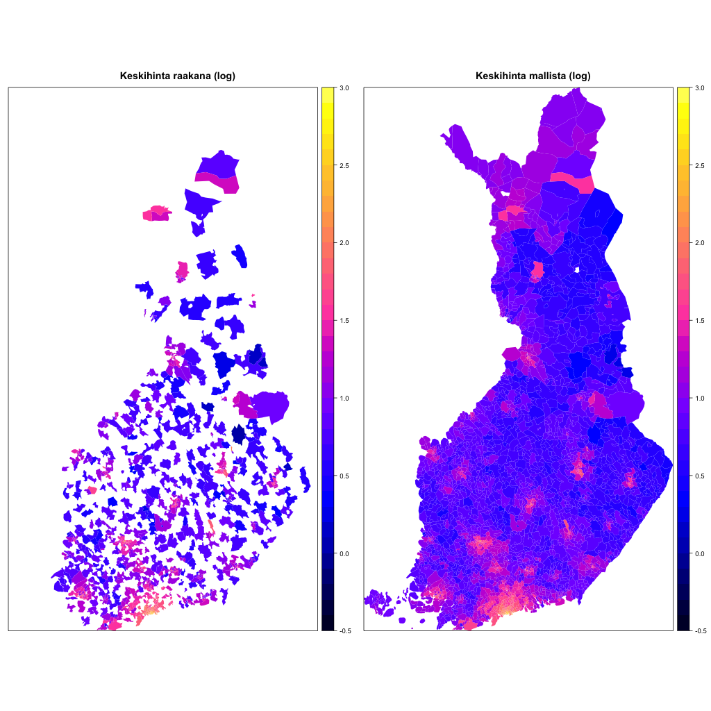
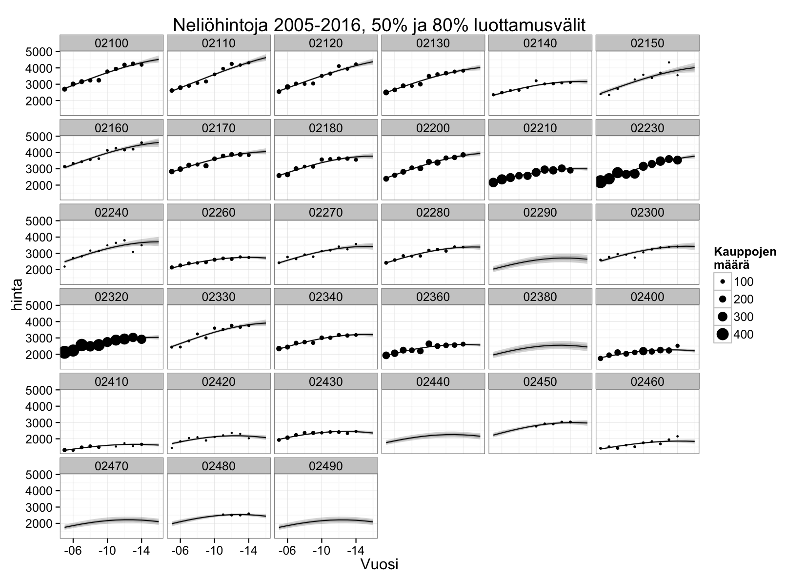

Basing on open data from [Statistics Finland](http://www.stat.fi/index_en.html), we at [Reaktor](http://reaktor.com/datascience) modelled Finnish apartment prices and their trends, on the zip-code level, during 2005--2014.  Estimates from the model are available as an [interactive visualization](http://kannattaakokauppa.fi/).

## Why model 

The original price data consists of local (geometric) mean sales prices per year. The number of sales is available as well. If there are less than six sales, the mean price is censored. 

Holes in the data and noise from low number of transactions make it hard to evaluate local price levels, let alone their changes, except at the most urban areas.  

Yearly numbers of transactions for a few random zip codes are depicted on the left below. Censored slots are with red. On the right, all year-zip slots are ordered on the x-axis by their available number of sales data. We see that 17.5% of slots are censored, and about half of the mean prices are either missing or based on less than 30 transactions. 

Price from 6--30 sales _is not a reliable estimate of the local mean_, and deriving trends from so few sales is not going to be successful. (Still, it is repeatedly tried: There have been several top and bottom lists of apartment prices and their development published in the Finnish media lately. They are based on this raw data.) 

A statistical model has a concept of a _price level behind individual sales_. 
It can then make a distinction between variation of the underlying price level, systematically over time and place, from _random_ variation that is not explainable within the model. This is in contrast to looking at raw data, where all variation is taken at face value. 

When the model is _estimated_, it produces the underlying price level as its output. Of course, because the model cannot explain all variation in data, the price level estimates will also have a random component: Instead of a fixed value, we get a probability distribution. Means, trends, confidence intervals, etc., can be computed from these distributions. Provided the model is sensible, these estimates of underlying price trends can be much more informative than the raw data. Uncertainty of the estimates also reveals when nothing can be said. 

Some properties of zip code areas, like population density, will correlate strongly with apartment prices. Such properties, if known and included in the model, and adjacency or  hierarchy of the zip code areas, allows us to _generalize_ spatially: estimates of price level become available even on places where the data is sparse or there is no data at all. Of course, uncertainty will then be higher, and the model will tell us that.

Below, the map on the left shows raw mean prices over the whole period 2005--2014. White areas are without any available data. Map on the right shows the (mean) price level estimates from a model. 

Below yearly mean prices and estimates of the underlying price level are depicted, for some zip codes at Espoo, part of the capital area of Finland. Shading around the lines indicate uncertainty of the estimates. Even on this relatively urban area, there are subareas with few enough sales to introduce considerable random variation to the raw prices: 02150 or Otaniemi, 02240 or Friisilä, 02330 or Kattilalaakso, etc. Some areas have no sales at all, maybe even no apartments. 

The model can be used for forecasting, but future prices or trends will have large uncertainty, even larger than indicated by the model. The quadratic shape of the temporal dependency, currently in the model, was chosen to fir the data of the last decade, and give an idea of past price development that is easy to summarise. There is no reason why future changes in economy and policy would follow the same pattern.  Relative development of areas is more accurately predicted than absolute price levels or trends. Anyway, _the model is at its best at describing past development of apartment prices, especially their spatial differences. There is no guarantee future will follow the same pattern_. 

The model, data and environment are described in more detail below.

## Ympäristö

Mallinnus tehtiin [R-ympäristössä](http://www.r-project.org), itse malli [Stan-kirjastolla](http://mc-stan.org), ja kaikki lähdekoodi on saatavilla [GitHubista](https://github.com/reaktor/Neliohinnat).

## Data

[Asuntojen hintatiedot](http://www.stat.fi/til/ashi/index.html) saa Tilastokeskukselta kätevästi R:ään [Louhos](http://louhos.github.io/)- ja [Ropengov](http://ropengov.github.io/)-projektien kirjastoilla [pxweb](http://cran.r-project.org/web/packages/pxweb/index.html) (hinnat) ja [gisfin](https://github.com/ropengov/gisfin) (muut). Postinumeroalueiden karttapohja haettiin [Duukkikselta](http://www.palomaki.info/apps/pnro/). Skriptit datojen hakemiseen, käsittelyyn ja yhdistelyyn ovat [GitHub-repossa](https://github.com/reaktor/Neliohinnat).

## Karttavisualisointi

Karttapohjia postinumeroalueittaiselle aineistolle saa ainakin Tilastokeskuksen [Paavo-rajapinnasta](http://www.stat.fi/tup/rajapintapalvelut/paavo.html) ja [Duukkikselta](http://www.palomaki.info/apps/pnro/). Paavo tarjoaa kartasta kahta versiota. Merialueet sisältävä kartta ei sovi visualisointiin ilman erillistä rantaviivaa. Rantaviivaan rajattu näytti hyvältä, mutta tarkkuudesta maksettaisiin GeoJSON-objektin koolla: yli 20 megatavua. Päädyimme käyttämään Duukkiksen pohjaa, jossa karkea rantaviiva tuottaa meille hyvän kompromissin koon ja ulkonäön välillä. 

Pieniä eroja postinumeroissa oli, joten muutama alue on saattanut karttapohjan valinnan takia kadota. 

Malli tuottaa hinta-arvioita vaikkei postinumerossa olisi osakehuoneistoja, kaupoista puhumattakaan: pelkkä sijainti ja väestötiheys riittävät. Muutamilta pieniltä, teollisuus- ja sairaala-alueiden näköisiltä postinumeroilta puuttuu väestötietokin, ehkä koska niissä ei virallisesti asu ketään. Nämä pienet postinumeroalueet näkyvät kartassa harmaana ja ilman ennustetta. 

## Malli

Mallin asuntojen hinnoista pitää ottaa huomioon monta asiaa. Tärkein on tietenkin *toteutuneiden kauppojen hinnat* — joista tiedämme vain keskiarvon jos sitäkään. Tiedossa olevan kauppojen lukumäärä auttaa, koska keskinta kertoo tarkemmin hintatasosta kun kauppoja on enemmän.

Koska kauppatietoa on etenkin maalta vähän, on hyvä ottaa malliin *postinumeroiden ominaisuuksia*, jotka selittävät hintavaihtelua. Taajamissa asunnot ovat kalliimpia, joten asumistiheys on ilmeisen tärkeää. Postinumeroittainen asukastiheys ei ole sama asia kuin keskimääräinen asumistiheys, mutta korreloi siihen vahvasti.

Hintojen alueellinen vaihtelu tekee lähekkäisistä postinumeroista keskimäärin samankaltaisia. Tätä voi hyödyntää hinta-arvioissa: naapuripostinumeron kaupat kertovat ainakin karkealla tasolla omastakin alueesta, etenkin jos oman alueen kauppoja on vähän. Tietenkään emme voi tehdä riippuvuudesta vahvaa oletusta, mutta voimme antaa mallin havaita riippuvuuden ja käyttää sitä, jos riippuvuutta on.

Päädyimme mallissa koodaamaan alueiden lähekkäisyyden hierarkiaksi, joka saadaan suoraan numerosta: Esim. 02940 on Uusimaata (0), Espoota (02) ja Pohjois-Espoota (029). Hierarkia antaa mahdollisuuden mallille pitää näiden ja muiden vastaavien sisäkkäisten alueiden postinumeroita samanlaisina ympäristöön verrattuna, jos ne sitä ovat. (Spatiaalinen lähekkäisyys olisi vaihtoehto, mutta se on monella tapaa teknisesti hankalampi ja kadottaa mahdollisen äititaajaman vaikutuksen.)

Hinnoissa kiinnostavinta on tason jälkeen ajallinen muutos. Niinpä hintatason ja vuoden keskinäinen suhde mallissa on oleellinen sen luonteen ja informatiivisuuden kannalta. Vuosille voisi kullekin antaa omat hintatasonsa, mutta hintatason ajallinen muutos olisi vapaiden vuositasojen mallissa liiankin vapaasti määritelty, eikä ennustetta ensi vuodelle syntyisi. Ja koska hintatason muutokset ovat hintojen tapaan alueellisia ja voivat riippua esim. väestötiheydestä, päädyimme malliin, jossa hinnan ajallinen muutos eli trendi ja trendin muutos ovat eksplisiittisesti mukana. 

Vuoden vaikutus mallissa on siis kvadraattinen, ts. joka postinumerolla on mallissa oma trendinsä ja trendin muutosnopeus per vuosi. Lisäksi väestötiheys pääsee ennustamaan näitä muutoksia. Sen vaikutus näkyy etenkin jos kauppoja on vain vähän tai ei ollenkaan. 

Postinumerokohtaisia hintaparametreja kertyy yhteensä kuusi: hintataso, trendi, trendin muutos, ja väestötiheyden vaikutus näihin kaikkiin. Parametreilla on arvot ja varianssit myös postinumeroa isommille hierarkian alueille (Uusimaa, Espoo, jne.), josta ne pääsevät vaikuttamaan postinumerokohtaisiin arvioihin etenkin kun kauppoja on vähän. Parametreilla on myös eri hierarkiatasoilla kovarianssit, jolloin ne voivat auttaa toistensa estimointia tapauksissa joissa hintadata ei suoraan riitä. 

Yhteenvetona kaavaksi, mallin alataso havaitulle keskihinnalle $y$ on 

$$
\log h_{it} = 
       \beta_{i1} + \beta_{i2} t + \beta_{i3} t^2 + \beta_{i’4}d_i + \beta_{i’5}d_i\,t + \beta_{i’6}d_i\,t^2, 
$$
$$
\log y_{it} \sim 
\textrm{t}\,\left(\log h_{it}, \, \sqrt{\sigma^2_y + \frac{\sigma^2_w}{n_{it}}}, \, \nu\right)\,,
$$
jossa $i$ on postinumeroalue, $t$ vuosi, $\beta$ ovat postinumerokohtaisia hintakertoimia, $i’$ on postinumeron alin hierarkiataso (väestötiheysparametrit ovat yhteisiä kullekin $i’$-alueelle), $t()$ on t-jakauma, $\sigma_y$ vuosikohtainen hajonta, $\sigma_w$ kauppahintojen hajonta mittausyksikön (vuosi$\times$postinumero) sisällä, ja $\nu$ t-jakautuneen residuaalin vapausaste. Hinnat käsitellään mallissa logaritmisena, jolloin absoluuttisella hintaskaalalla malli on multiplikatiivinen. Hajonnat ja $\nu$ estimoidaan kaiken muun ohella. Kertoimille $\beta$ on multinormaali priori kovarianssimatriiseineen, ja lisäksi ylemmille hierarkiatasoille eli postinumeroa suuremmille alueille omat vastaavat rakenteensa ($\beta$ ja sen priorit). Yksityiskohdat tätä tarkemmin selviävät parhaiten [mallikoodista](https://github.com/reaktor/Neliohinnat/blob/master/source/m4.stan). 

Vapausasteen $\nu$ estimaatti on luokkaa 6,5, eli hintojen residuaali on normaalijakaumaa selvästi pitkähäntäisempi. Suoraan mallin parametreista (koodissa matriisi "Omega") nähdään, että hintataso ja trendi korreloivat yli postinumeroalueiden ($r$=0,28), samoin trendin muutos ja hintataso ($r$=0,43). Halvat alueet ovat siis viimeisen n. kymmenen vuoden aikana halventuneet edelleen, ja kalliit kallistuneet. Tämä liittynee asutuksen keskittymiseen. 

Postinumerokohtaisista estimaateista nähdään, että asukastiheys korreloi niin hintatasoon kuin sen muutoksiinkin:

Malli on estimoitu Stan-kirjastolla ([http://mc-stan.org/](http://mc-stan.org/)). Stan on [todennäköisyysohjelmointikieli](https://louhos.wordpress.com/2014/01/29/stan-kj/), joka tuottaa generatiivisesta mallin kuvauksesta estimointialgoritmin. Vaihtoehdoista estimoinnin itse koodaaminen olisi huomattavan työlästä, kun taas valmiiden mallipakettien (lme4, mgcv, …) käyttäminen pakottaisi tyytymään rajoittuneempaan malliin, joka kuvaisi asuntojen hintoja ja niiden vaihtelua huonommin. 

